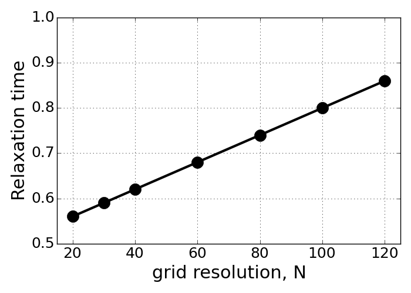

=============
 Problem1 - c
=============

Examine the effect of the relaxation time :math:`\tau` and the Mach number on method stability using your simulations, and compare your results to the stability criteria. Discuss how these parameters relate to the required grid size and physical time step size.

