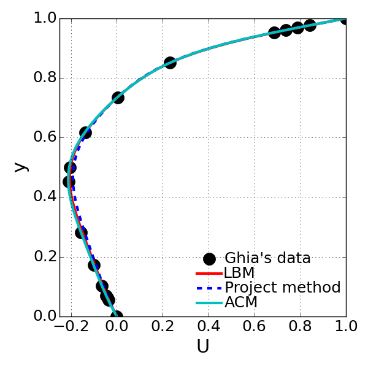
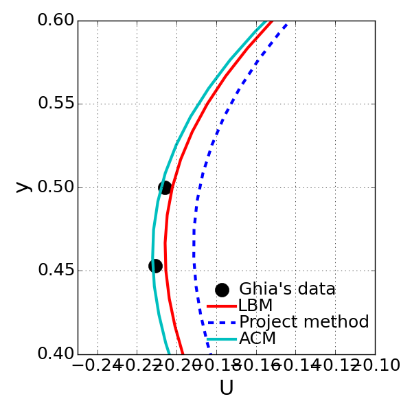

=============
 Problem1 - g
=============

Compare the results obtained in homework 3,4, and 5. Discuss the advangates and disadvantages of the methods.

In this test, Re=100 case has been chosen for the desired comparison because this case doesn't not require impractically higher grid resolution such that the test can be performed very efficiently. The selected grid resolution is 60x60 and three different solution methods were tested under the same condition.

<Comparison on the calculated u-velocity along the centerline with different solution method: bottom image is the magnified one for noticing the discrepancy>

  +------------------------------+------------------+-------------------+------------------+
  |                              |  LBM             | Projection method | ACM              |
  +==============================+======================================+==================+
  | RMS of u-velocity            | 0.00413982355618 | 0.00857537642521  | 0.00132103968968 |
  +------------------------------+------------------+-------------------+------------------+
  | Iterations for convergence   | 4889             | 3496              | 37017            |
  +------------------------------+------------------+-------------------+------------------+
  | Compute time for convergence | 784.86           | 4145.3            | 1711.31          |
  +------------------------------+------------------+-------------------+------------------+

